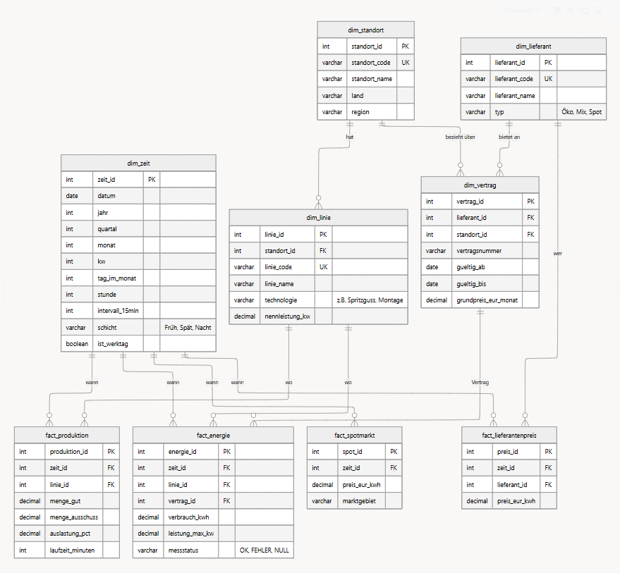

# DB_Electric – Stromkosten-Analysesystem

**3. Semester Datenbanken WDS24A – Capstone Projekt**

---

## Szenario

| **Kategorie** | **Details** |
|---------------|-------------|
| **Unternehmen** | Supernova Industries GmbH (Mittelstand, Metallverarbeitung/Stanzteile) |
| **Struktur** | 5 Standorte, 15 Produktionslinien, 3-Schicht-Betrieb |
| **Volumen** | Ca. 10 Mio. € Jahresstromkosten, 4 Lieferanten |
| **Annahme** | **Homogene Produktstruktur:** Da alle Linien vergleichbare Stanzteile produzieren, sind die Stückkosten (€/Einheit) als KPI direkt vergleichbar. |

**Technologien:** Python 3.12+, pandas, SQLite, uv

---

## Schritt 1: Stakeholder & Fragen definieren

### Frage 1: Stromkostenintensität (Finanz-Perspektive)

**Kernfrage:** Welche Standorte wiesen im Zeitraum Q1–Q4 2024 strombezogene Stückkosten (€/Einheit) auf, die mehr als 15% über dem unternehmensweiten Durchschnitt lagen?

| **Aspekt** | **Spezifikation** |
|------------|-------------------|
| **Stakeholder** | CFO (Chief Financial Officer) |
| **Entscheidung** | Priorisierung von Modernisierungsbudgets für "Ausreißer"-Standorte. |
| **Risiko** | Fehlallokation von Investitionsbudget; Ineffizienzen werden übersehen. |
| **Messgrößen** | Stromkosten pro Einheit (€/Stück), Abweichung vom Durchschnitt (%). |
| **Zeitfenster** | 12 Monate (Q1–Q4 2024), quartalsweise aggregiert. |
| **Frequenz** | Quartalsweise (Reporting). |
| **Erfolgskriterium** | Streuung der Stückkosten zwischen Standorten < 10%. |
| **Benötigte Daten** | Produktionsmengen, Energieverbrauch, Vertragspreise (`fact_produktion`, `fact_energie`). |

### Frage 2: Lastspitzen-Analyse (Operative Perspektive)

**Kernfrage:** Welche Produktionslinien und Schichten sind die *systematischen Treiber* für die Überschreitung der 500kW-Lastgrenze?

| **Aspekt** | **Spezifikation** |
|------------|-------------------|
| **Stakeholder** | Produktionsleitung |
| **Entscheidung** | Schichtplanänderung: Energieintensive Prozesse verteilen |
| **Risiko** | Überhöhte Leistungspreiskosten durch unkontrollierte Spitzen. |
| **Messgrößen** | MAX(kW) pro 15-Min-Intervall, Count(Spitzen > 500kW), Auslastung (%). |
| **Zeitfenster** | 3 Monate (Okt–Dez 2024), Analyse nach Schicht/Tageszeit. |
| **Frequenz** | Wöchentlich (Operatives Dashboard). |
| **Erfolgskriterium** | Maximal 2 Lastspitzen > 500kW pro Monat und Standort. |
| **Hinweis** | **NULL-Handling:** Sensorwerte können fehlen → müssen gefiltert werden. |

### Frage 3: Lieferanten-Benchmarking (Strategische Perspektive)

**Kernfrage:** Wie hoch ist der *effektive Preisaufschlag* unserer Lieferanten gegenüber dem Spotmarkt-Benchmark im Zeitraum von 2023–2024?

| **Aspekt** | **Spezifikation** |
|------------|-------------------|
| **Stakeholder** | Einkauf |
| **Entscheidung** | Kündigung teurer Verträge; Wechsel zu Lieferanten mit stabileren Preisen. |
| **Risiko** | Dauerhaft überhöhte Energiebeschaffungskosten. |
| **Messgrößen** | AVG(€/kWh) je Lieferant, Abweichung Spotmarkt (%). |
| **Zeitfenster** | 24 Monate (Jan 23 – Dez 24), monatlich aggregiert. |
| **Frequenz** | Quartalsweise sowie Ad-hoc bei Vertragsverhandlungen. |
| **Erfolgskriterium** | Kein Lieferant konstant > 10% über Spotmarkt-Durchschnitt. |
| **Hinweis** | Erfordert **n:m-Beziehung** (Lieferanten ↔ Standorte) und externe Marktdaten. |

---

## Schritt 2: Datenmodell entwerfen (Kimball-Ansatz)

### Herleitung nach Kimball Top-Down Prinzip

**Frage 1 → Modell-Entscheidung:**
- Stromverbrauch (kWh) und Stückzahl (Stück) fallen zu unterschiedlichen Zeitpunkten an.
- **Lösung:** Zwei getrennte Faktentabellen (`fact_energie`, `fact_produktion`), Verknüpfung über gemeinsame Dimensionen.

**Frage 2 → Modell-Entscheidung:**
- Lastspitzen erfordern hohe zeitliche Auflösung (Tagesdurchschnitt würde Spitzen "glattbügeln").
- **Lösung:** Granularität von `fact_energie` auf **15-Minuten-Intervalle** festgelegt.

**Frage 3 → Modell-Entscheidung:**
- Ein Standort kann wechselnde Lieferanten haben, ein Lieferant beliefert mehrere Standorte (m:n).
- **Lösung:** Bridge-Table `dim_vertrag` + externe Benchmark-Tabelle `fact_spotmarkt`.

### ER-Diagramm (Star Schema)



### Indexierung

| Index | Spalte(n) | Begründung |
|-------|-----------|------------|
| `idx_zeit_jahr_quartal` | `dim_zeit(jahr, quartal)` | Reports sind zeitbasiert ("Zeig mir Q1 2024") |
| `idx_zeit_jahr_monat` | `dim_zeit(jahr, monat)` | Monatliche Aggregationen |
| `idx_energie_zeit` | `fact_energie(zeit_id)` | JOIN-Performance |
| `idx_energie_linie` | `fact_energie(linie_id)` | JOIN-Performance |
| `idx_produktion_zeit` | `fact_produktion(zeit_id)` | JOIN-Performance |

---

## Schritt 3: Daten generieren

```
DIMENSIONEN (Stammdaten)        FAKTEN (Bewegungsdaten)
├── dim_zeit          ~70.000   ├── fact_produktion       ~28.000
├── dim_standort           5    ├── fact_energie         ~962.000
├── dim_linie             15    ├── fact_spotmarkt        ~70.000
├── dim_lieferant          4    └── fact_lieferantenpreis ~281.000
└── dim_vertrag            6
```

| **Tabelle** | **Quelle** | **Begründung** |
|-------------|------------|----------------|
| `dim_zeit` | Generiert | Spezifische Attribute (Schicht) erforderlich |
| `dim_standort` | Generiert | Fiktives Unternehmen |
| `dim_linie` | Generiert | Fiktive Produktionslinien |
| `dim_lieferant` | Generiert | Fiktive Lieferanten |
| `dim_vertrag` | Generiert | Fiktive Vertragskonditionen |
| `fact_produktion` | Generiert | Keine öffentlichen Quellen |
| `fact_energie` | Hybrid | Muster aus echten Daten, Details generiert |
| `fact_spotmarkt` | **Echt** | SMARD/EPEX Spot Daten |

---

## Schritt 4: Daten laden

**Ansatz:** Automatisierter "Full Reload" via Python & SQLite.

1. **Reset:** Alte Datenbank löschen
2. **Schema:** Tabellenstruktur via `create_tables.sql` erstellen
3. **Import:** CSV-Daten via pandas einlesen
4. **Gatekeeper:** Datenqualitätsregeln anwenden (siehe Schritt 6)
5. **Check:** Validierung durch Zeilenzählung

---

## Schritt 5: Queries entwickeln & analysieren

### Query 1: Stromkostenintensität

**Architektur:** Star-Schema-JOINs + Subqueries

| Schritt | Aktion |
|---------|--------|
| Basis | `fact_energie` (Messwerte) |
| Anreicherung | JOIN `dim_zeit`, `dim_linie`, `dim_standort` |
| Filter | `WHERE jahr = 2024 AND messstatus = 'OK'` |
| Gruppierung | `GROUP BY standort_id` |
| Berechnung | Python: `kosten_pro_stueck = (energie × preis) / menge` |

**Takeaway:** Eine Query, drei Datenquellen (Energie + Produktion + Preise)

---

### Query 2: Lastspitzen-Analyse

**Ergebnis:** Index auf `leistung_max_kw` → **nutzlos** (Lean Indexing)

| Aspekt | Detail |
|--------|--------|
| **Hypothese** | Index beschleunigt Suche nach Spitzen > 500 kW |
| **Realität** | Optimizer ignoriert Index (33.6ms vs 36.0ms) |
| **Root Cause** | Zeit-Filter reduziert Datenmenge bereits stark genug |
| **Entscheidung** | Index gelöscht → Speicherplatz & INSERT-Performance gespart |

---

### Query 3: Lieferanten-Benchmarking

**Ergebnis:** CTE statt UNION → **+16% Performance** (1.2x Speedup)

| Aspekt | Detail |
|--------|--------|
| **Hypothese** | `UNION ALL` erzwingt doppelten Scan von `dim_zeit` |
| **Realität** | Benchmark bestätigt: 260ms → 224ms |
| **Root Cause** | SQLite materialisiert CTE im RAM (Ephemeral Table) |
| **Effizienz** | 50% weniger Lesezugriffe auf `dim_zeit` |

---

## Schritt 6: Datenqualität & NULL-Logik

### Gatekeeper-Regeln (ETL)

| Regel | Tabelle | Logik | Aktion |
|-------|---------|-------|--------|
| **A: Sensor-Check** | `fact_energie` | `verbrauch_kwh` oder `leistung_max_kw` ist NULL | `messstatus = 'FEHLER'` |
| **B: Join-Versicherung** | `fact_energie` | `vertrag_id` fehlt | Fülle mit `-1` (Sentinel) |
| **C: Text-Hygiene** | `dim_vertrag` | `vertragsnummer` fehlt | Fülle mit `'UNKNOWN'` |

**Warum Sentinel Values?**

1. **Datenverlust vermeiden:** `INNER JOIN` auf `NULL` löscht Zeilen stumm
2. **Rechenfehler vermeiden:** `NULL` ist mehrdeutig in `AVG`/`SUM`

---

## Schritt 7: MongoDB-Analyseteil (Konzept)

**Szenario:** MongoDB als Hochgeschwindigkeits-Puffer vor dem SQL-Warehouse

| Vorteil | Begründung |
|---------|------------|
| **Ingest-Speed** | Keine Schema-Checks → keine DB-Locks bei Sensor-Last |
| **Bucketing** | Zeitreihen in komprimierten Blöcken statt Einzelzeilen |
| **TTL-Cleanup** | Automatische Löschung alter Daten (in SQL teuer) |

**Datenfluss:**
```
Sensor (1Hz) → MongoDB (Cache) → ETL (Verdichtung) → SQL (Reporting)
```

---

## Installation & Ausführung

```bash
# Abhängigkeiten installieren
uv sync

# Gesamte Pipeline ausführen
uv run python main.py

# Einzelne Schritte
uv run python main.py --skip-generate              # Nur Laden + Queries
uv run python main.py --skip-generate --skip-load  # Nur Queries
uv run python main.py --visualize                  # Mit Visualisierungen

# Benchmark
uv run python src/benchmark.py -i 30               # 30 Iterationen
uv run python src/benchmark.py -r -i 30            # Mit DB-Reset
```

---

## Projektstruktur

```
DB_Electric/
├── main.py                          # Pipeline-Orchestrierung
├── pyproject.toml                   # Projektdefinition (uv)
├── data/
│   ├── create_tables.sql            # DDL-Schema
│   ├── er_diagramm.png              # ER-Diagramm
│   ├── stromkosten.db               # SQLite-Datenbank
│   ├── grosshandelpreise_*.csv      # SMARD-Quelldaten
│   └── generated/                   # Generierte CSVs
├── output/
│   ├── frage*_*.png                 # Visualisierungen
│   └── benchmarks/                  # Benchmark-Ergebnisse
└── src/
    ├── benchmark.py                 # Performance-Messung
    ├── data_generation/             # Python-Generatoren
    ├── data_loading/
    │   └── load_to_sqlite.py        # CSV → SQLite (mit Gatekeeper)
    └── queries/
        ├── frage1.sql               # Stromkosten
        ├── frage2.sql               # Lastspitzen
        ├── frage2_optimized.sql     # Lastspitzen (mit Index)
        ├── frage3.sql               # Lieferanten (UNION)
        ├── frage3_optimized.sql     # Lieferanten (CTE)
        ├── run_queries.py           # Query-Runner
        └── visualize.py             # Chart-Generierung
```

---

## Executive Summary

### Projektziel
Entwicklung eines analytischen Datenmodells zur Beantwortung von drei Business-Fragen im Bereich Energiekostenmanagement.

### Methodik
- **Stakeholder-First:** 3 Fragen → 9 Tabellen
- **Kimball Star-Schema:** 4 Fakten + 5 Dimensionen
- **ETL mit Gatekeeper:** NULL-Handling vor dem Load

### Ergebnisse

| Query | Erkenntnis |
|-------|------------|
| **Stromkosten** | Hamburg-Harburg >15% über Durchschnitt (niedrige Produktionseffizienz) |
| **Lastspitzen** | München-Garching verursacht 3× mehr Spitzen (Spätschicht) |
| **Lieferanten** | Spotmarkt günstigste Preise, aber höchste Volatilität |

### Key Takeaways

1. **Fragen zuerst, Modell danach**
2. **Datenqualität am Eingang** (Gatekeeper)
3. **Messen, nicht raten** (Index-Beispiel)
4. **CLEAN CODE GILT AUCH IN SQL**

---

## Team

WDS24A – Datenbanken, 3. Semester
